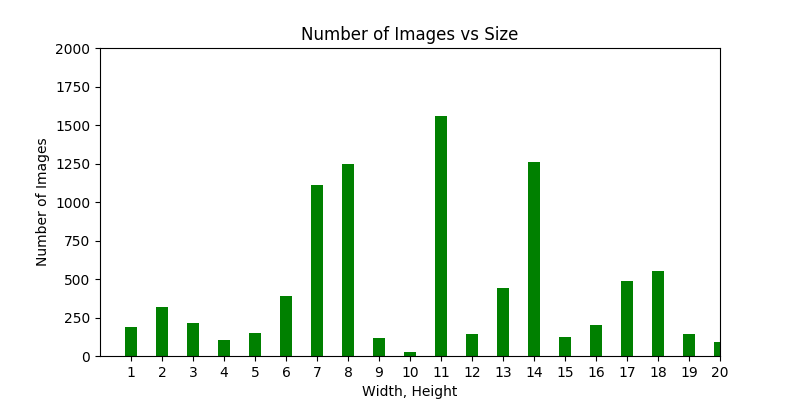

# Inventory Classifier - Material count and classification using Convolutional Neural Net

by David Andresky

As an electrical engineer I have developed numerous electronic devices and partnered with operations on the introduction and ramp up of my products. From domestic fulfillment centers to large contract manufacturing facilities in Asia, there are consistent pain points and inefficiencies with regards to material handling and inventory management. Some common issues include:

- Selecting the right component
- Warehouse space utilization
- Just in time throughput
- Inefficient distribution of materials
- Lack of automation

Machine learning tools can be leveraged to help solve these crucial business issues and many more. With this project, I intend to design a deep learning neural network capable of counting and identifying inventory items in a warehouse from images of their storage locations. Armed with this capability, robotic tools and systems can be developed to automate processes allowing material and production planners to improve operations efficiency and reduce costs.

### Minimum Viable Product

Due to the time frames for the capstone project, the MVP will be a trained network that can count each of the distinct items in a storage location.

### MVP +

As time permits, I will expand the project to classify items either categorically or as unique part numbers/descriptions.

# The Data

The Inventory Classifier will be developed and trained using the Amazon Bin Image Data Set.

Amazon has an automated inventory management system where items are stored in random locations based on space available. As part of their open data program, they have made more than half a million images of inventory bins from one of their fulfillment centers available for research, along with JSON documents describing the contents of each of the bins that can be used to train the model on.  

The image and json document below are an example of what is available.  

[Associated JSON file](img/523.json)

### Some Statistics

- There are 536,436 bin images and one json document for each image.
- There are 460,512 unique item classes depicted in the images.
- The following figure shows that most items show up only once or twice in all of the images.

- The next figure shows the distribution of items on a per bin basis.

- The largest image width is 1202 pixels and the largest height is 1193 pixels
- The smallest image width is 289 pixels and the smallest height is 192 pixels
- There are ?? unique images size and the following figure illustrates an example distribution of 20 image sizes.

# Project Plan

My notes on the implementation details can be found in the following documents:
- [Amazon Machine Image (AWS)](docs/aws-environment) - Setup details for the AMI I created for this project.
- [Data Processing](docs/data-processing) - Notes on the images and JSON files supplied and how AWS S3 and EC2 are leveraged for storage and processing.
- [Model Development](docs/model-development.md) - Notes on my strategy for developing the neural net model architecture. Includes intermediate steps or tests that may not make it in the final model.

### Technologies

- Keras
- [Python Resize Image v1.1.11](https://pypi.python.org/pypi/python-resize-image)
- TensorFlow

# Source Files

The following is a brief overview of the source files and their use in the project.  

- [explore-data.py](src/explor-data.py) - this script is written to facilitate exploration of the data. Some functions may have value later in the project.
- [keras-cifar10-cnn-eval.py](src/keras-cifar10-cnn-eval.py) - a script with an example CNN architecture that classifies images from the CIFAR-10 dataset. Purpose is to test EC2 AMI's with an architecture that has a known baseline and to explore some of the Keras framework.
