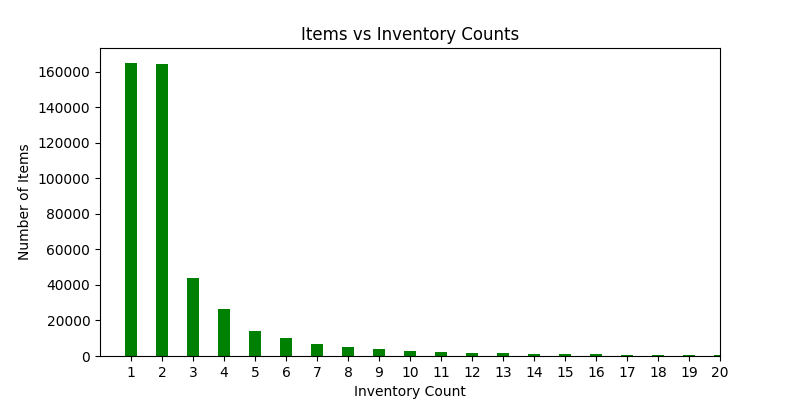
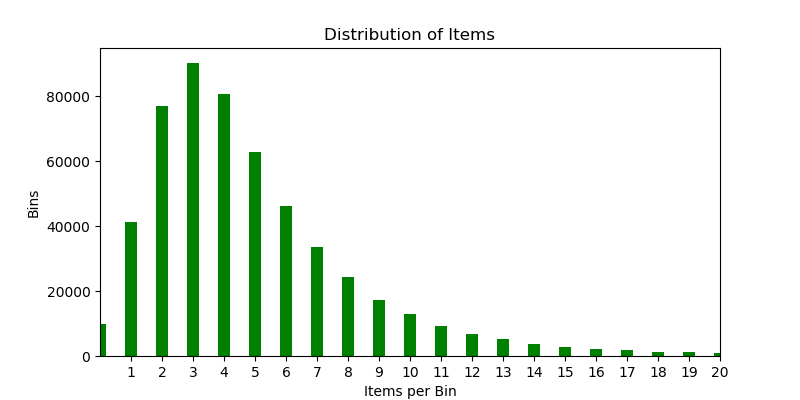

# Inventory Classifier - Material count and classification using Convolutional Neural Net

by David Andresky

As an electrical engineer I have developed numerous electronic devices and partnered with operations on the introduction and ramp up of my products. From domestic fulfillment centers to large contract manufacturing facilities in Asia, there are consistent pain points and inefficiencies with regards to material handling and inventory management. Some common issues include:

- Selecting the right component
- Warehouse space utilization
- Just in time throughput
- Inefficient distribution of materials
- Lack of automation

Machine learning tools can be leveraged to help solve these crucial business issues and many more. With this project, I intend to design a deep learning neural network capable of counting and identifying inventory items in a warehouse from images of their storage locations. Armed with this capability, robotic tools and systems can be developed to automate processes allowing material and production planners to improve operations efficiency and reduce costs.

### Minimum Viable Product (MVP and MVP+)

My MVP is a trained network that can distinguish between empty and non-empty bins. My MVP+ is a trained network that can count generic items in a bin. Due to the difficult nature of the problem, I limit counting up to 5 and 10 items.

### MVP +

As time permits, I will expand the project to classify items either categorically or as unique part numbers/descriptions.

# The Data

The Inventory Classifier will be developed and trained using the Amazon Bin Image Data Set.

Amazon has an automated inventory management system where items are stored in random locations based on space available. As part of their open data program, they have made more than half a million images of inventory bins from one of their fulfillment centers available for research, along with JSON documents describing the contents of each of the bins that can be used to train the model on.  

The image and json document below are an example of what is available.  

[Associated JSON file](img/523.json)

### Some Statistics

- There are 536,436 bin images and one json document for each image.
- There are 460,512 unique item classes depicted in the images.
- The following figure shows that most items show up only once or twice in all of the images.

- The next figure shows the distribution of items on a per bin basis.

### Data Screening (counting)

For classifying empty vs. non-empty bins, I screen the dataset selecting all images with empty bins and then randomly selecting an equal number of images from the rest of the dataset. There are approximately 10k empty bin images.

For counting items I employ a similar screening process, selecting all empty bin images, and then randomly selecting and equal number of images from 1-item bins, 2-item bins, and so on.

# Project Overview

### Counting Items in a bin (MVP and MVP+)

Identifying and counting generic items in an image without labels is a particularly difficult challenge.

### Classifying Items (MVP++)

There are too many item classes and no single item class occurs frequently enough in the dataset to be able to build a CNN that can recognize the class. State of the art CNN's do reasonably well with sample sizes on the order of 500 to 1000, but the vast majority of items in the Amazon Bin Image dataset show up fewer than 20 times in the entire corpus.

The first part of my strategy is to use NLP techniques to extract latent features of the item descriptions given in every json file and derive some classes that represent item categories. My goal is to discover no more than 100-200 classes with every class containing at least 1000 images to train on.

The second part of my strategy is to leverage a very important property of deep learning models, and that is the ability to pretrain a model on a larger dataset, such as the Imagenet dataset, then use it to bootstrap the learning process on a smaller dataset. There are many pre-trained models publicly available for download that can be used to bootstrap learning. I might also be able to use the model I train for counting items in a bin.

See this [Keras blog](https://blog.keras.io/building-powerful-image-classification-models-using-very-little-data.html) for an example on training a model with small datasets. Of particular interest is the strategy to "augment" the images via a number of random transformations, so that our model would never see twice the exact same picture. This helps prevent overfitting and helps the model generalize better.

### Notes

My notes on the implementation details can be found in the following documents:
- [Amazon Machine Image (AWS)](docs/aws-environment) - Setup details for the AMI I created for this project.
- [Data Processing](docs/data-processing) - Notes on the images and JSON files supplied and how AWS S3 and EC2 are leveraged for storage and processing.
- [Model Development](docs/model-development.md) - Notes on my strategy for developing the neural net model architecture. Includes intermediate steps or tests that may not make it in the final model.

### Technologies

The following is a list of the core technologies used for my capstone project.

- keras
- TensorFlow
- MongoDB
- Spark

This capstone project uses the Amazon AWS Deep-Learning AMI which contains approximately a dozen pre-configured enviroments. I used the 'tensorflow_p36' environment for my project which contains the core technologies listed above. However, the environment didn't contain all of the packages needed to run my code. The following is a list of the packages I added

- [Python Resize Image v1.1.11](https://pypi.python.org/pypi/python-resize-image)
- [scikit-image](http://scikit-image.org/docs/dev/install.html) (has a bug, not using at this time, use python-resize-image instead)
- [simplejson](https://pypi.python.org/pypi/simplejson/) - used for development purposes to save data to a local text file
- [sklearn](http://scikit-learn.org/stable/install.html)

To install a package in a conda environment, 'source activate' the environment, then 'pip install <package name>'. Check installation with 'conda list'.  
See these sites for references on managing the conda environments

- https://conda.io/docs/user-guide/tasks/manage-pkgs.html
- https://conda.io/docs/user-guide/tasks/manage-environments.html

# Source Files

The following is a brief overview of the source files and their use in the project.  

- [explore-data.py](src/explore-data.py) - this script is written to facilitate exploration of the data. Some functions may have value later in the project.
- [image-processing.py](src/image-processing.py) - contains ImageProcessing class that scans the data folders, extracts image labels, and selectively pulls desired images to be resized and converted to arrays.
- [keras-cifar10-cnn-eval.py](src/keras-cifar10-cnn-eval.py) - a script with an example CNN architecture that classifies images from the CIFAR-10 dataset. Purpose is to test EC2 AMI's with an architecture that has a known baseline and to explore some of the Keras framework.
- [model_A.py](src/model_A.py) - functions to build, evaluate, and perform predictions on a custom deep learning model designed for the Amazon bin-image dataset.
- [model_vgg16.py](src/model_vgg16.py) - functions to build a model based on the VGG16 architecture and pre-trained on the Imagenet dataset. Functionality includes computing bottleneck features, training a top layer, and fine tuning.
